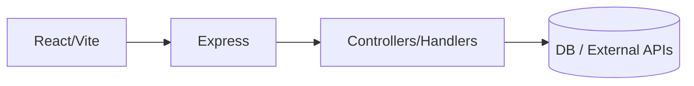
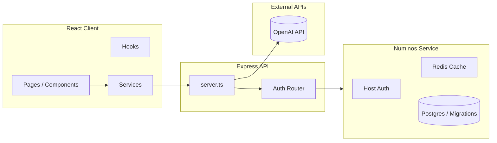

## Architecture Overview

This document describes the structure and responsibilities of the `dream-app` (Anima Insights) repository.

### Core Flow (Condensed)



Requests originate in the React client and hit the Express layer, which attaches a `requestId` to every incoming call for log correlation. Controllers (auth, search, analysis) perform validation using Zod in shadow mode by default; strict enforcement is enabled globally or per-route via environment flags. Service logic may call into persistence (Drizzle/Postgres via sidecar) or external APIs (OpenAI) before returning structured JSON responses. Environment variables govern secrets, feature toggles, and validation modes—see `.env.example`. Pino logging (with redaction) ensures sensitive fields (passwords, tokens) are not logged while preserving traceability through the propagated `requestId`.

### High-Level Concept

The application consists of:

1. A Vite + React frontend (`src/`) that renders the user interface, performs client-side routing, and calls backend/API endpoints.
2. A lightweight Express server (`src/server.ts`) exposing health and Jung books search endpoints and mounting authentication routes.
3. A secondary service package (`numinos-service/`) that encapsulates host authentication logic, Redis/Postgres integration, migrations, and related scripts.
4. Shared configuration, scripts, and database artifacts (Drizzle migrations) at the root.

### Directory Structure (Relevant Folders)

```
root/
  src/                      # Frontend React application + server entry
    components/             # Reusable UI components
    pages/                  # Route components (e.g., Account, Oracle, Register)
    hooks/                  # Custom React hooks (theme, auth, etc.)
    services/               # Client-side service helpers / API clients
    server/                 # Express auth and API routes (simple & extended auth routers)
    config/                 # Environment parsing (env.ts) and related config
    db/                     # (If present) database related client code or schema usage
    types/                  # TypeScript type definitions
    utils/                  # Helper utilities
  numinos-service/          # Sidecar/service: auth host tokens, migrations, Redis usage
    src/                    # Service source code (auth, cache, storage, prompts)
    drizzle/                # SQL migrations for sidecar persistence
    docs/                   # Service-specific docs (auth, security, GDPR, etc.)
    scripts/                # Helper scripts (request host token, migrations)
  drizzle/                  # Root-level migrations (if used by main app)
  public/                   # Static assets (icons, embed scripts)
  scripts/                  # Repo utility scripts (pre-commit secret scan, db setup)
  docs/                     # Project-wide documentation (architecture, openapi, training guides)
  .github/workflows/        # Continuous Integration and security workflows
```

### Runtime Flow



### Environment Variables (Usage Map)

| Variable | Consumed In | Purpose |
|----------|-------------|---------|
| VITE_OPENAI_API_KEY | `src/config/env.ts`, OpenAI client usage | AI analysis requests |
| VITE_JWT_SECRET | `src/config/env.ts` (client side gating) | Token handling (should mirror server secret) |
| VITE_API_URL | `src/config/env.ts` & services | Base URL for API requests |
| VITE_APP_NAME / VITE_APP_VERSION | `src/config/env.ts` | Display / meta info |
| VITE_ENV | `src/config/env.ts` | Environment mode flags |
| VITE_MFA_ENABLED | `src/config/env.ts` | Feature toggle for MFA UI |
| VITE_ANALYTICS_ENABLED | `src/config/env.ts` | Conditional analytics init |
| PORT | `src/server.ts` | Express server port |
| LOG_LEVEL | `src/server.ts` (logger) | Control log verbosity |
| JWT_SECRET | Auth server (routes.auth.ts) | Server-side JWT signing/verification |
| REDIS_URL | numinos-service (Redis usage) | Caching / rate limiting |
| DATABASE_URL / POSTGRES_* | numinos-service & migrations | Database connectivity |
| HOST_PRIVATE_KEY_PATH / HOST_PUBLIC_KEY_PATH | numinos-service host auth | Signed assertion keys |

### Request Lifecycle (Example)
1. User interacts with React component.
2. Component calls a service wrapper that uses `VITE_API_URL`.
3. Express route (`server.ts`) receives the request; may delegate to auth router.
4. Auth router (simple or extended) processes tokens (JWT_SECRET) and responds.
5. For AI features, server or sidecar may invoke OpenAI using `VITE_OPENAI_API_KEY`.
6. Responses returned to client; caching may occur in `TTLCache` or Redis layer.

### Authentication Layers
- Simple router (`routes.auth.simple.ts`): Health/test endpoints.
- Extended router (`routes.auth.ts`): Registration, login, refresh, logout, profile.

### Data & Persistence
- Drizzle migrations present (`drizzle/` and `numinos-service/drizzle/`).
- Sidecar may handle Postgres persistence and migration scripts.
- SQLite path placeholder provided for alternative local dev.

### Logging & Monitoring
- `pino` used for structured logging in server.
- Potential integration points for Sentry / analytics behind feature flags.

### Build & Tooling
- Vite for client bundling / dev server.
- TypeScript for static typing across client and service.
- ESLint + Prettier for lint/format.
- Husky + lint-staged for pre-commit hygiene.

### Security Notes
- Secrets managed via env vars; `.env.example` contains placeholders only.
- Pre-commit secret scanning script present (`scripts/prevent-secrets.sh`).
- Gitleaks + CodeQL + Dependabot integrated via GitHub Actions.

### Future Improvements (Suggested)
- Unify auth route usage (remove legacy simple router once migration complete).
- Centralize zod schemas for request/response to auto-generate OpenAPI.
- Add integration tests for critical auth + search flows.

---
This document will evolve as architecture changes. Keep modifications truthful; avoid speculative layers.